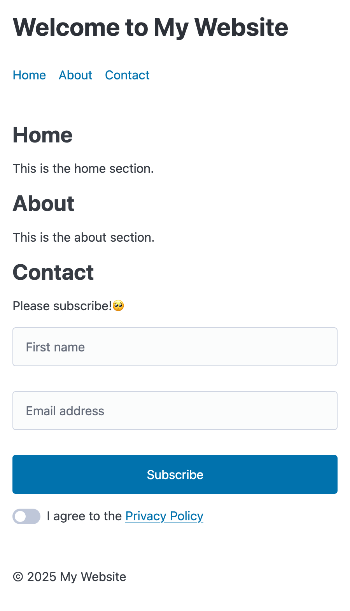

# go-html-compose

A Go library for writing code that resembles the form and structure of html,
and then rendering to actual HTML at runtime.

## Usage

Write your content, like in the [test example](./pkg/internal/test/example_test.go).

```go
package main

import (
	a "go-html-compose/pkg/attr"
	d "go-html-compose/pkg/doc"
	t "go-html-compose/pkg/tag"
	"io"
)

func renderHomePage(wr io.Writer) error {
	content := t.Html(a.Lang("en"))(
		t.Head()(
			t.Meta(a.Charset("UTF-8")),
			t.Meta(a.Name("viewport"), a.Content("width=device-width, initial-scale=1.0")),
			t.Meta(a.Name("color-scheme"), a.Content("light dark")),
			t.Title()(d.TextS("Example HTML Page")),
			t.Link(a.Rel("stylesheet"), a.Href("https://cdn.jsdelivr.net/npm/@picocss/pico@2/css/pico.min.css")),
		),
		t.Body()(
			t.Header(a.Class("container"))(
				t.H1()(d.TextS("Welcome to My Website")),
				t.Nav()(
					t.Ul()(
						t.Li()(t.A(a.Href("#home"))(d.TextS("Home"))),
						t.Li()(t.A(a.Href("#about"))(d.TextS("About"))),
						t.Li()(t.A(a.Href("#contact"))(d.TextS("Contact"))),
					),
				),
			),
			t.Main(a.Class("container"))(
				t.Section(a.Id("home"))(
					t.H2()(d.TextS("Home")),
					t.P()(d.TextS("This is the home section.")),
				),
				t.Section(a.Id("about"))(
					t.H2()(d.TextS("About")),
					t.P()(d.TextS("This is the about section.")),
				),
				t.Section(a.Id("contact"))(
					t.H2()(d.TextS("Contact")),
					t.P()(d.TextS("Please subscribe!🥺")),
					t.Form()(
						t.Div(a.Class("grid"))(
							t.Input(
								a.Type("text"),
								a.Name("firstname"),
								a.Placeholder("First name"),
								a.AriaProp("label", "First name"),
								a.Required(true),
							),
							t.Input(
								a.Type("email"),
								a.Name("email"),
								a.Placeholder("Email address"),
								a.AriaProp("label", "Email address"),
								a.Autocomplete("email"),
								a.Required(true),
							),
							t.Button(a.Type("submit"))(d.TextS("Subscribe")),
						),
						t.Fieldset()(
							t.Label(a.For("terms"))(
								t.Input(a.Type("checkbox"), a.Role("switch"), a.Id("terms"), a.Name("terms")),
								d.TextS("I agree to the "),
								t.A(a.Href("#"), a.Onclick("alert('Hello, World!')"))(d.TextS("Privacy Policy")),
							),
						),
					),
				),
			),
			t.Footer(a.Class("container"))(
				t.P()(d.TextS("© 2025 My Website")),
			),
		),
	)
	return content.Render(wr)
}
```

This produces a minified version of

```html
<html lang="en">
  <head>
    <meta charset="UTF-8" />
    <meta name="viewport" content="width=device-width, initial-scale=1.0" />
    <meta name="color-scheme" content="light dark" />
    <title>Example HTML Page</title>
    <link
      rel="stylesheet"
      href="https://cdn.jsdelivr.net/npm/@picocss/pico@2/css/pico.min.css"
    />
  </head>

  <body>
    <header class="container">
      <h1>Welcome to My Website</h1>
      <nav>
        <ul>
          <li><a href="#home">Home</a></li>
          <li><a href="#about">About</a></li>
          <li><a href="#contact">Contact</a></li>
        </ul>
      </nav>
    </header>
    <main class="container">
      <section id="home">
        <h2>Home</h2>
        <p>This is the home section.</p>
      </section>
      <section id="about">
        <h2>About</h2>
        <p>This is the about section.</p>
      </section>
      <section id="contact">
        <h2>Contact</h2>
        <p>Please subscribe!🥺</p>
        <form>
          <div class="grid">
            <input
              type="text"
              name="firstname"
              placeholder="First name"
              aria-label="First name"
              required="required"
            /><input
              type="email"
              name="email"
              placeholder="Email address"
              aria-label="Email address"
              autocomplete="email"
              required="required"
            /><button type="submit">Subscribe</button>
          </div>
          <fieldset>
            <label for="terms"
              ><input type="checkbox" role="switch" id="terms" name="terms" />I
              agree to the
              <a href="#" onclick="alert('Hello, World!')"
                >Privacy Policy</a
              ></label
            >
          </fieldset>
        </form>
      </section>
    </main>
    <footer class="container">
      <p>© 2025 My Website</p>
    </footer>
  </body>
</html>
```



## Development

Generate and Test. See [generate](./pkg/generate/)

```
go generate ./...
go test ./...
```

Custom test helpers are in [`./pk/internal/test/utils.go`](./pkg/internal/test/utils.go).
